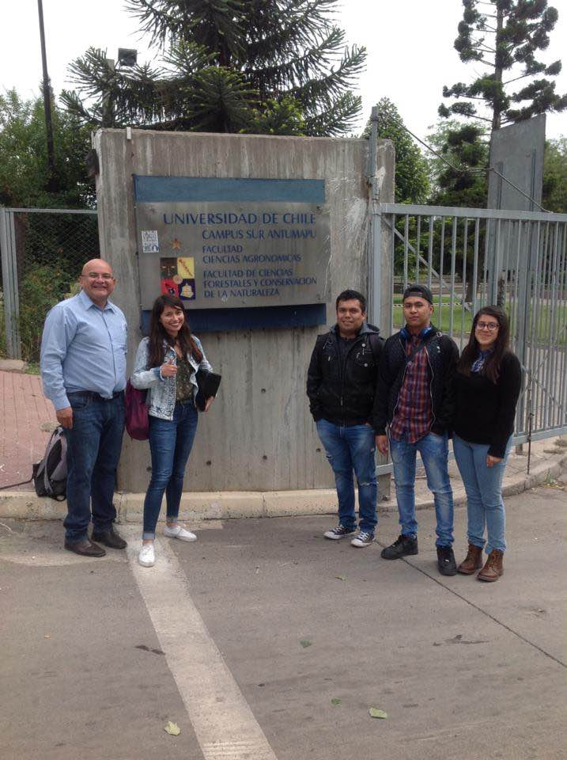
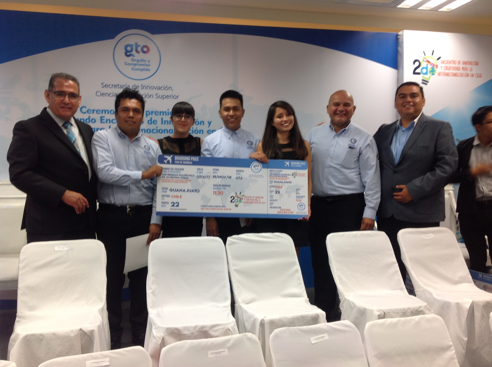
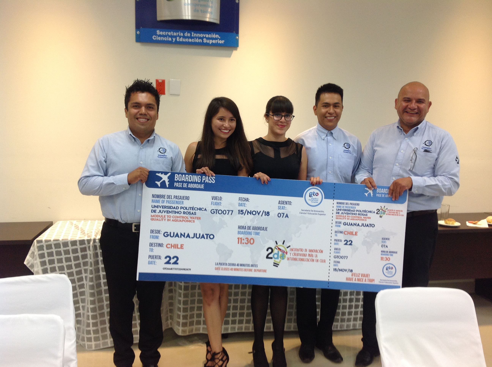

## Chile
## We won a scolarchip in December 2018. We visited the university Chile (https://www.uchile.cl).

## 4 students and me present a project about aquaponics Systema using [Raspberry](https://github.com/luisreylara/raspberry/) and [IoT](https://github.com/luisreylara/).

Project in a Chile Country

